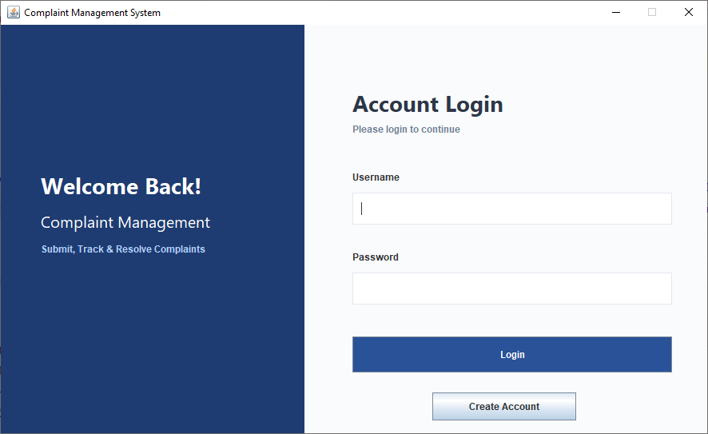
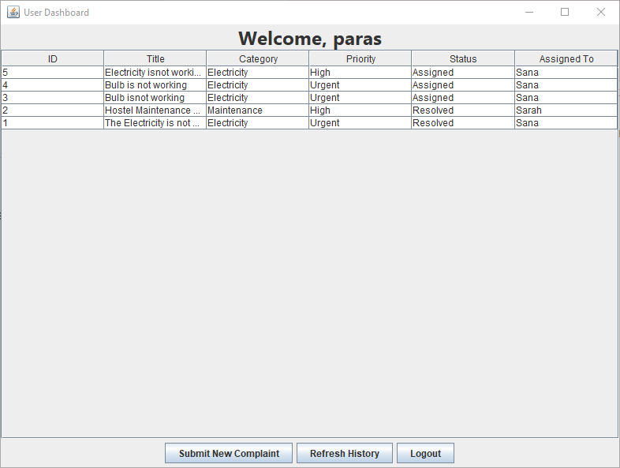
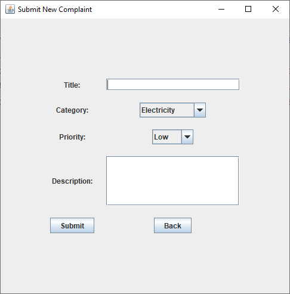
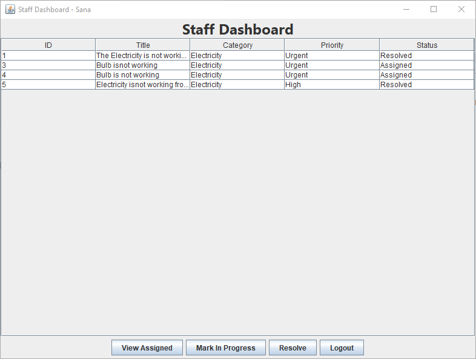
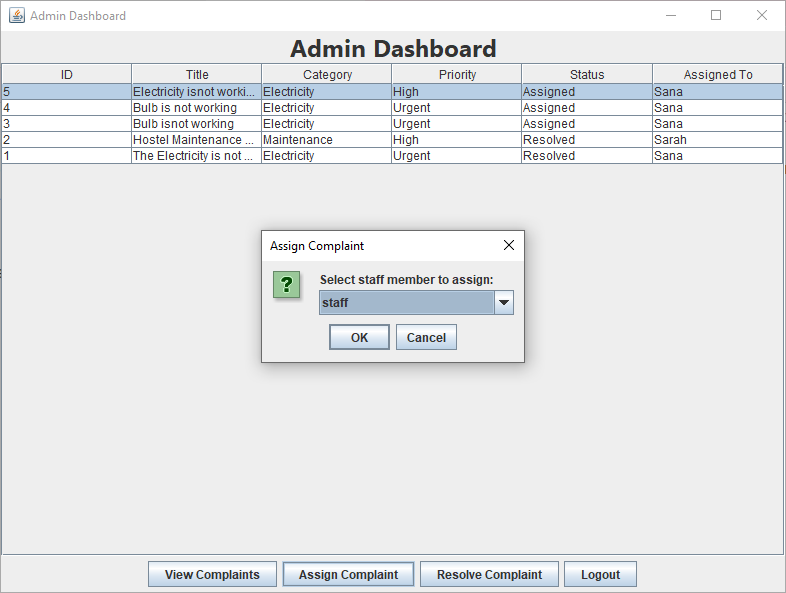

# 🖥️ Digital Complaint Management System

A Java Swing desktop application that enables users to submit, track, assign, and resolve complaints through separate User, Staff, and Admin dashboards. The project demonstrates Object-Oriented Programming principles, GUI development, and MySQL database integration.

---

## ✨ Features

- 🔐 User Registration & Login
- 👤 User Dashboard
- 📝 Submit New Complaints
- 📋 Track Complaint Status
- 👨‍💼 Staff Dashboard
- 📌 Assign Complaints to Staff
- ✅ Resolve Complaints
- 🛠️ Admin Dashboard
- 🗄️ MySQL Database Integration
- 💻 Java Swing Graphical User Interface

---

## 🛠️ Technologies Used

- Java
- Java Swing
- JDBC
- MySQL
- Apache NetBeans / IntelliJ IDEA

---

## 📸 Screenshots

### 🔐 Login Screen



---

### 👤 User Dashboard



---

### 📝 Submit Complaint



---

### 👨‍💼 Staff Dashboard



---

### 🛠️ Admin Dashboard



---

## 📂 Project Structure

```
src/
test/
complaint_system.sql
build.xml
manifest.mf
```

---

## 🗄️ Database Setup

1. Install MySQL.
2. Create a new database.
3. Import the provided `complaint_system.sql` file.
4. Update the database credentials in the Java project if required.
5. Run the project.

---

## 🚀 How to Run

1. Clone this repository.

```
git clone https://github.com/parasaijaz09/digital-complaint-management-system.git
```

2. Open the project in IntelliJ IDEA or Apache NetBeans.

3. Configure the MySQL database.

4. Run the project.

---

## 🔮 Future Improvements

- Better UI design
- Search and filter complaints
- Email notifications
- Charts & Analytics
- File attachment support
- Dark Mode

---

## 👩‍💻 Developed By

- **Paras Aijaz**
- **Sajja Khalil**

**Course:** Object-Oriented Programming

**University:** SZABIST Larkana

---

## ⭐ If you like this project

Please consider giving it a ⭐ on GitHub.
